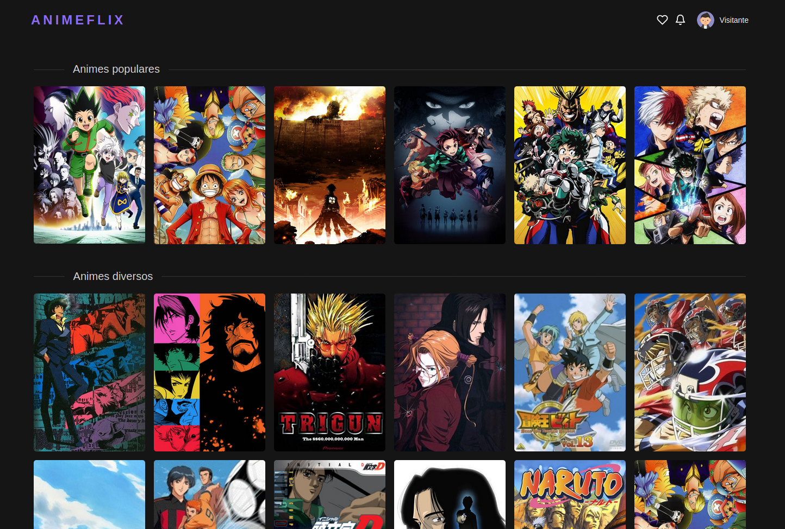

# Animeflix

<!---Esses são exemplos. Veja https://shields.io para outras pessoas ou para personalizar este conjunto de escudos. Você pode querer incluir dependências, status do projeto e informações de licença aqui--->


## Descrição

O desafio proposto foi desenvolver uma interface que ofereça um catálogo de animes, onde o usuário pode acessar informações básicas de cada filme (Imagens de referência, sinopse, trailer e outras informações) consumindo a API do [Kitsu](https://kitsu.docs.apiary.io/#).

## Tecnologias utilizadas

* [NextJS](https://nextjs.org/)
* [Ant Design](https://ant.design/)
* [Less CSS](https://lesscss.org/#)

## Instalação

Primeiro, faça um clone do projeto em sua máquina
```
git clone https://github.com/Viiict0r/ch-technical-test.git
```

No diretório do projeto, utilize um gerenciador de pacotes para instalar as dependências e executar o projeto
```
npm install ou yarn
```

Agora execute o projeto
```
npm run dev ou yarn dev
```

Após executar, você pode acessá-lo em: http://localhost:3000

## Deploy

O deploy do projeto foi feito utilizando a [Vercel](https://vercel.com), e pode ser acessado [por aqui](https://ch-technical-test.viiict0r.vercel.app).

<br>

[⬆ Voltar ao topo](#Animeflix)<br>
